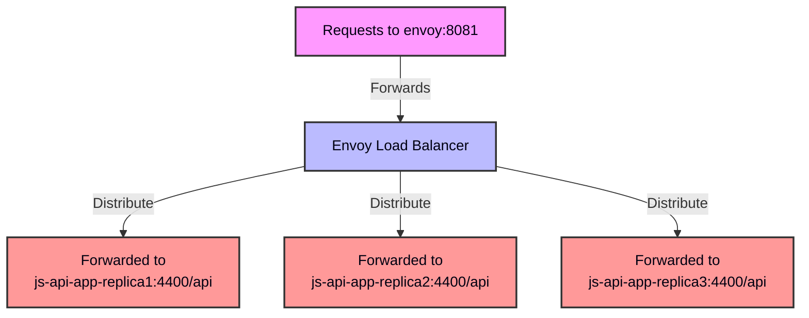

# Example of Rate Limiting with Envoy

Small example of rate limiting with Envoy. It can be executed by running the [`docker-compose.yml`](docker-compose.yml) file that includes the following three services:

- 3 instances of [js-api-app](../utils/js-api-app/README.md) as application to have APIs
- [Envoy](https://www.envoyproxy.io/) v1.30.0 as a reverse proxy and rate limiter (the configuration is in [envoy.yaml](envoy.yaml))
- [k6](https://k6.io/) v0.54.0 as a load testing tool (the script is in [k6.js](k6.js))

## How it works

The following is to try to understand how Envoy [rate limiting on routes](https://www.envoyproxy.io/docs/envoy/latest/configuration/http/http_filters/rate_limit_filter) works. 

The example has been set up to have Envoy as a reverse proxy for a small API application (`js-api-app`) that has only one endpoint (`/api`, that returns a JSON object with some simple metadata). When the route is hit, the cluster will redirect the call to one of the three replicas of _js-api-app_ (called: _js-api-app-replica1_, _js-api-app-replica2_ and _js-api-app-replica3_) in a _round robin_ fashion.

_K6_ is used to send requests to the API application: we simulate an user that sends requests every 10 milliseconds, for 30 seconds. We expect that the number of requests are quite evenly distributed between the replicas.

The following diagram shows a representation of the flow of the requests:



## How to run it

There's a [docker-compose.yml](docker-compose.yml) file that can be used to run all the services. Can be easily run with the following command from this very folder:

```bash
docker-compose up
```

The test does not print anything, it is up to you to check what happens. You can run also run it in detach mode, and after check that k6 has completed its execution and returned the responses with `docker compose logs <k6-container-id>` (with _k6-container-id_ being the identifier of the k6 container).

If you run the service in attached mode, you'll see a lot of logs but you'll notice that the different replicas are called.
